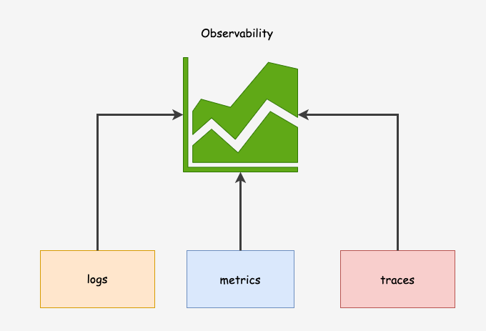
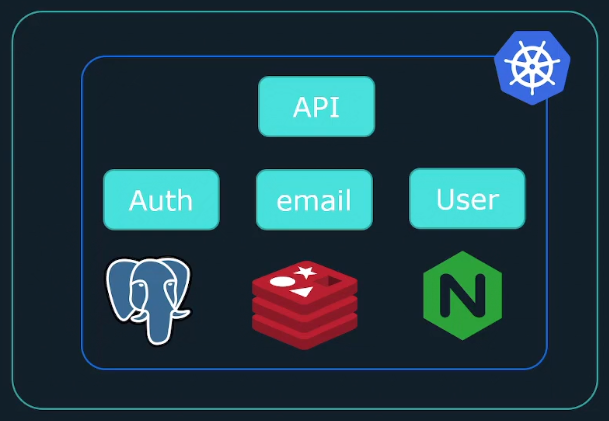

# Introdução a Observabilidade

## O que é Observabilidade?
Observabilidade – A capacidade de compreender e medir o estado de um sistema com  base nos dados de saída (como logs, métricas e traces) que ele gera.

O site da Opentelemetry descreve a Observabilidade de uma maneira agradável.
<pre>
A observabilidade nos permite entender um sistema de fora, deixando-nos fazer perguntas sobre esse sistema sem conhecer seu funcionamento interno. Além disso, permite-nos solucionar e lidar facilmente com novos problemas (i.e. “unknown unknowns”), e ajuda-nos a responder à pergunta, “Por que isso está acontecendo?”
opentelemetria.io
</pre>

## Diferença entre Observabilidade e Monitoramento

<pre>
Monitoramento é uma ferramenta ou solução técnica que permite às equipes observar e entender o estado de seus sistemas. O monitoramento é baseado na coleta de conjuntos predefinidos de métricas ou logs.

Observabilidade é uma ferramenta ou uma solução técnica que permite que as equipes depurem ativamente seu sistema. A observabilidade é baseada na exploração de propriedades e padrões não definidos com antecedência.

devops-research.com
</pre>

**Monitoramento** trata-se de ficar de olho em problemas conhecidos e métricas de aplicativos/sistemas.

Envolve a configuração de alertas e limites para métricas específicas (como uso da CPU, uso de memória, tempos de resposta, tempos de execução de consulta de banco de dados, taxas de erro 4xx, 5xx, etc.) e outros KPIs de monitoramento documentados para notificar as equipes quando algo der errado.

    Por exemplo, uma ferramenta de monitoramento envia um alerta quando o uso da CPU do server’ ultrapassa 80% ou quando o tempo de resposta de uma API excede 2 segundos.

**Observabilidade** por outro lado, vai um passo além.

Trata-se de entender o estado interno dos aplicativos e sistemas observando suas saídas (como logs, métricas e traces). Não se trata apenas de saber quando algo dá errado, mas também de entender por que deu errado.

A chave Foco o of Observability é mais exploratório e investigativo, permitindo que você faça perguntas arbitrárias sobre o comportamento das aplicações e diagnostique problemas que você antecipou.

    Por exemplo, quando um site começa a desacelerar inesperadamente, você usa ferramentas de observabilidade para analisar padrões de dados, solicitações de rastreamento e registros de revisão para identificar que uma implantação de código recente causou um vazamento de memória, levando a tempos de resposta mais lentos.

A observabilidade permite gerar resultados acionáveis a partir de cenários inesperados em ambientes dinâmicos

A observabilidade ajudará:

1. Dê uma visão melhor do funcionamento interno de um sistema/aplicativo
2. Acelere a solução de problemas
3. Detecte problemas difíceis de detectar
4. Monitore o desempenho de um aplicativo
5. Melhore a colaboração entre equipes

O principal objetivo da observabilidade é melhor enentender o interior do seu sistema

À medida que as arquiteturas de sistema continuam a obter mais
e mais complexos, novos desafios surgem à medida que
rastrear problemas se torna muito mais
desafiante.

Há uma necessidade maior de observabilidade à medida que
avançar para sistemas distribuídos e
aplicativo baseado em microsserviços.

Quando se trata de solucionar problemas, precisamos de mais informações
do que apenas o que está errado. Precisamos saber por que nosso aplicativo entrou em um estado específico, o que componente é responsável e como podemos evitá-lo no futuro.

- Por que as taxas de erro estão aumentando
- Por que há alta latência
- Por que os serviços estão expirando

A observabilidade oferece flexibilidade para entender eventos imprevisíveis

