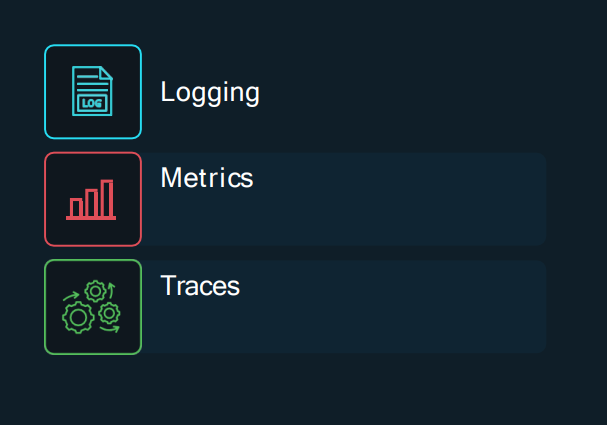
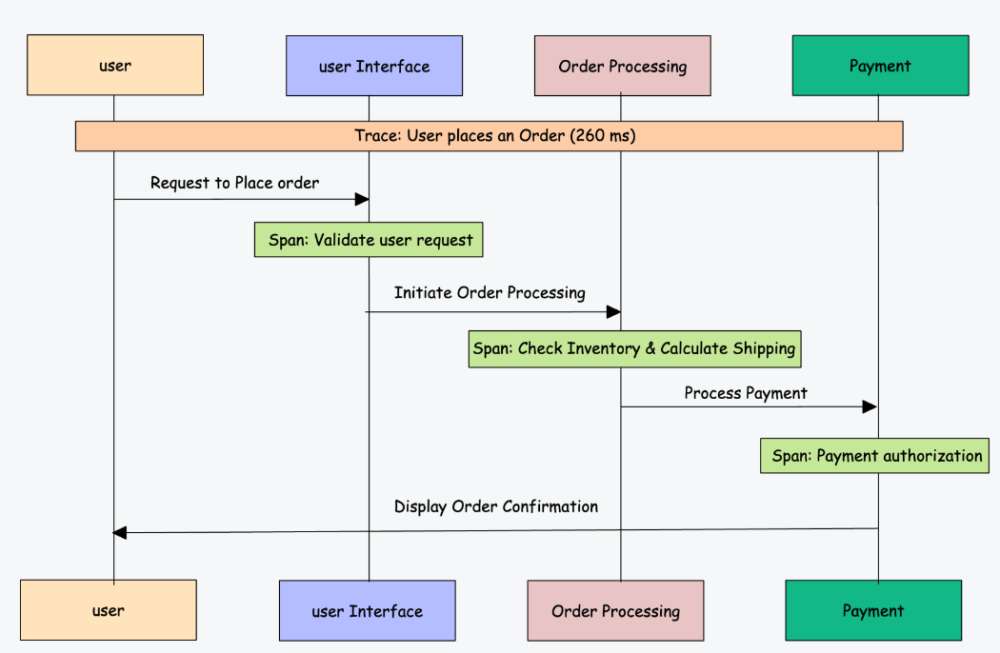

# 3 pilares da Observabilidade

Como alcançamos a observabilidade?

# Logs

Logs são registros detalhados de eventos, atividades ou mensagens geradas por um sistema, aplicativo ou dispositivo. Esses registros são essenciais para o monitoramento, diagnóstico de problemas, auditoria e análise de desempenho em ambientes computacionais

Os registros são compostos por:
- Timestamp de data e hora de quando o log ocorreu
- Mensagem contendo informações

<pre>
2023-11-20 10:15:32 INFO  UserService: Starting getUserById for userId=12345
2023-11-20 10:15:32 DEBUG UserService: Fetching user data from database for userId=12345
2023-11-20 10:15:33 INFO  UserService: User data retrieved successfully for userId=12345
2023-11-20 10:15:34 WARN  UserService: User 12345 has outdated profile information
2023-11-20 10:15:35 ERROR UserService: Failed to send notification email to userId=12345, email=johndoe@example.com
2023-11-20 10:15:35 INFO  UserService: getUserById completed for userId=12345
</pre>

Logs são a forma mais comum de observação produzida por sistemas. No entanto, eles podem ser difíceis de usar devido ao detalhamento dos logs gerados pelo sistemas/aplicativos

Os Logs de processos provavelmente estarão interligados com outros processos simultâneos espalhados por vários sistemas

# Metrics
Métricas são dados representados em números medidos em intervalos de tempo.

Por exemplo, node_memory_MemAvailable_bytes métrica em prometheus mostra a quantidade de memória disponível em bytes. O http_request_duration_seconds métrica rastreia a duração das solicitações HTTP.

Aqui está um exemplo de métricas geradas pelos exportadores da Prometheus.
<pre>
http_requests_total{method="post",code="200"} 1027
http_requests_total{method="post",code="400"} 3
http_request_duration_seconds_bucket{le="+Inf"} 134091
http_request_duration_seconds_sum 52123
http_request_duration_seconds_count 134091
node_memory_MemAvailable_bytes 2.147483648e+09
node_cpu_seconds_total{mode="user"} 9123.42
</pre>

As métricas desempenham um papel fundamental na observabilidade. Com as métricas, você pode entender o estado do seu sistema rapidamente e ao longo do tempo e ajudá-lo a encontrar tendências e padrões sobre o comportamento dos sistemas em momentos diferentes.

# Traces & Spans

**“Traces”** e **“Spans”** são termos usados principalmente no rastreamento distribuído.

O **rastreamento distribuído** é um método usado para rastrear e monitorar o fluxo de solicitações através de sistemas distribuídos, particularmente em arquiteturas de microsserviços.

Vamos dar uma olhada em um exemplo de aplicativo de comércio eletrônico construído com microsserviços.

Quando um usuário faz um pedido, a solicitação viaja através de vários serviços: primeiro é acessado pelo serviço de processamento de pedidos, que se comunica com os serviços de inventário, pagamento e conta de usuário.

O rastreamento distribuído rastreará essa solicitação em todos esses serviços.

Aqui, o **traces** representa toda a jornada de uma única solicitação de pedido através do sistema. Cada trace consiste em vários **spans**, onde cada intervalo representa uma operação ou processo específico dentro do rastreamento.

