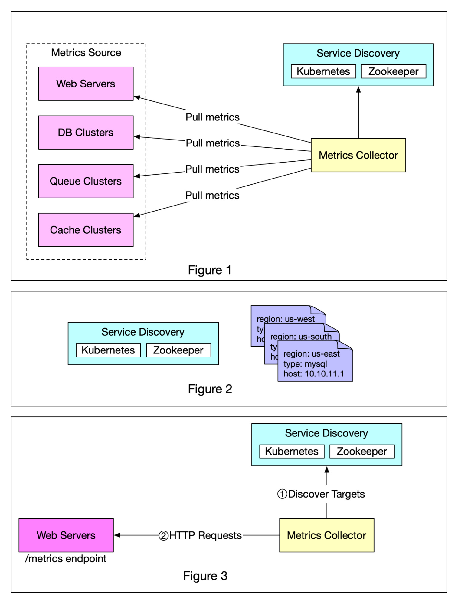

# Push vs Pull

Existem duas maneiras de coletar dados de métricas: pull ou push. É um debate rotineiro sobre qual é o melhor e não há uma resposta clara. Neste post, daremos uma olhada no modelo pull.

A Figura 1 mostra a coleta de dados com um modelo pull por HTTP. Temos coletores de métricas dedicados que extraem periodicamente valores de métricas dos aplicativos em execução.

Nesta abordagem, o coletor de métricas precisa conhecer a lista completa de terminais de serviço dos quais extrair dados. Uma abordagem ingênua é usar um arquivo para armazenar informações de DNS/IP para cada terminal de serviço nos servidores de “coletor de métricas”. Embora a ideia seja simples, essa abordagem é difícil de manter em um ambiente de grande escala onde os servidores são adicionados ou removidos com frequência, e queremos garantir que os coletores de métricas não percam a coleta de métricas de novos servidores.

A boa notícia é que temos uma solução confiável, escalável e de fácil manutenção disponível através do Service Discovery, fornecida por Kubernetes, Zookeeper, etc., onde os serviços registram sua disponibilidade e o coletor de métricas pode ser notificado pelo componente Service Discovery sempre que a lista de alterações nos terminais de serviço. A descoberta de serviço contém regras de configuração sobre quando e onde coletar métricas, conforme mostrado na Figura 2.
​
A Figura 3 demonstra o modelo pull em detalhes.

1️⃣ O coletor de métricas busca metadados de configuração de endpoints de serviço do Service Discovery. Os metadados incluem intervalo de extração, endereços IP, parâmetros de tempo limite e novas tentativas, etc.

2️⃣ O coletor de métricas extrai dados de métricas por meio de um endpoint HTTP predefinido (por exemplo, /metrics). Para expor o ponto final, normalmente é necessário adicionar uma biblioteca cliente ao serviço.