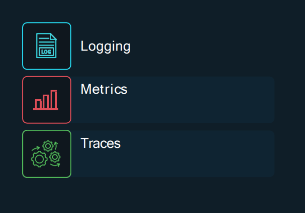
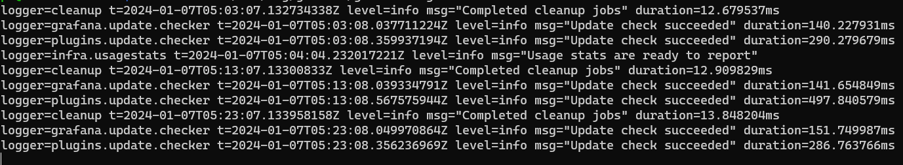

# 3 pilares da Observabilidade

Como alcançamos a observabilidade?

# Logs

Logs são registros detalhados de eventos, atividades ou mensagens geradas por um sistema, aplicativo ou dispositivo. Esses registros são essenciais para o monitoramento, diagnóstico de problemas, auditoria e análise de desempenho em ambientes computacionais

Os registros são compostos por:
- Timestamp de data e hora de quando o log ocorreu
- Mensagem contendo informações

Logs são a forma mais comum de observação produzida por sistemas. No entanto, eles podem ser difíceis de usar devido ao detalhamento dos logs gerados pelo sistemas/aplicativos

Os Logs de processos provavelmente estarão interligados com outros processos simultâneos espalhados por vários sistemas

# Traces

Cada trace tem um trace-id que pode ser usado para identificar uma solicitação como ela atravessa o sistema

Eventos individuais que formam um trace são chamados `spans`

Cada período rastreia o seguinte:
- Start time
- Duration
- Parent-id 